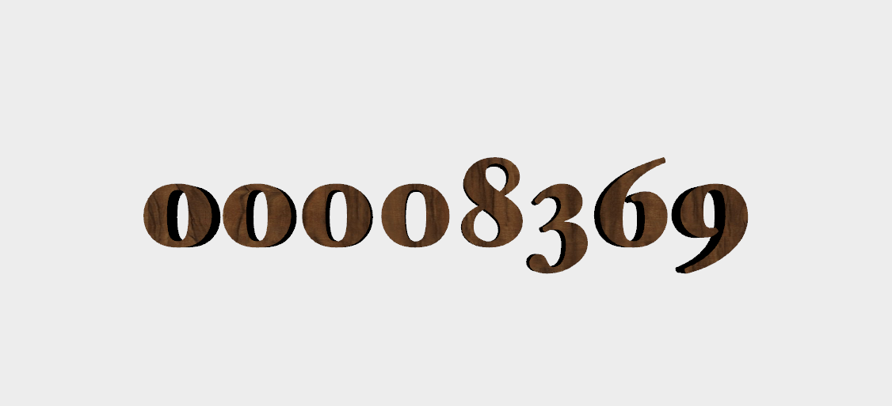

# Rendering Extruded 3D Text with Core Text, libtess2, and MetalKit

# Text no longer rotates, but shows millisecond timestamps at 120fps (where supported)

I did this as a quick way to measure screen input lag: mirror your 120fps capable display to another one, do a 240fps slow motion video of both screens and calculate the time difference by scrubbing through the video.

This repository contains the sample code for the [_Rendering 3D Text with Core Text and libtess2_](http://metalbyexample.com/text-3d/) article on _Metal by Example_.

